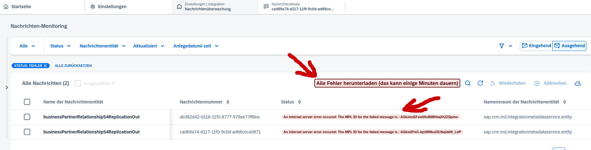

# Improve Message Monitoring for SAP Sales Cloud V2

## Functionality

This adds a button to download all error messages as plain text and as json, message headers included.
Furthermore it replaces the status-text "ERROR" or "Fehler" with the actual error message in the message monitoring overview table (only first error from first error-submessage) and also in the submessage table (all errors).

## Usage

Install the [User Script](./improveMessageMonitoringV2.js) via a browser addon like Greasemonkey, Tampermonkey or Violentmonkey (just copy it in there). Tested with Greasemonkey on Firefox

## Contributions

Contributions are welcome. I'm sure, there are a lot of improvements possible in functionality and also in efficiency and readability of the code.
